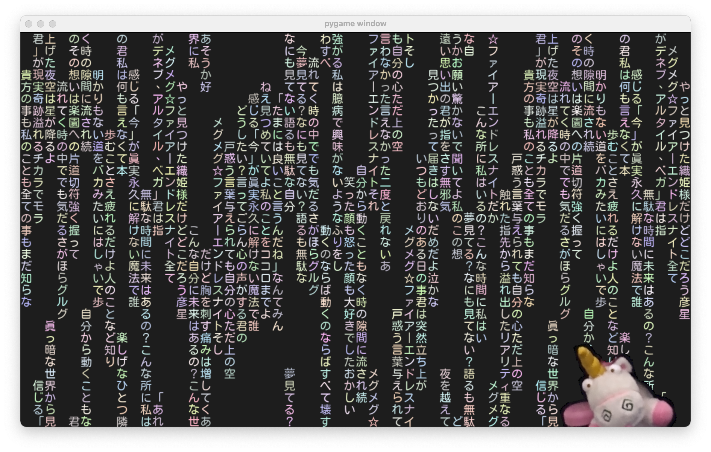
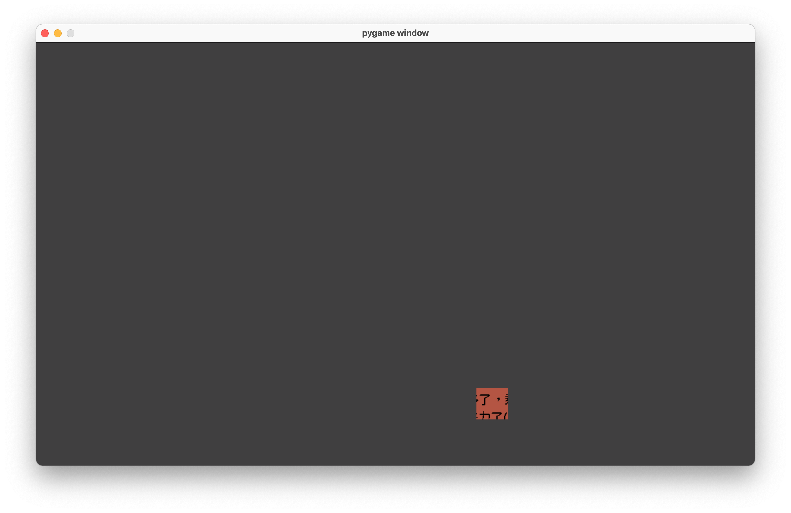

# pygame card with japanese cmatrix
#### with [@jerry960331](github.com/jerry960331)

------
### Japanese cmatrix 
Hidden hints will appear after unicorn pressed.

### card with features
Hole will move along with mouse to reveal card context.

